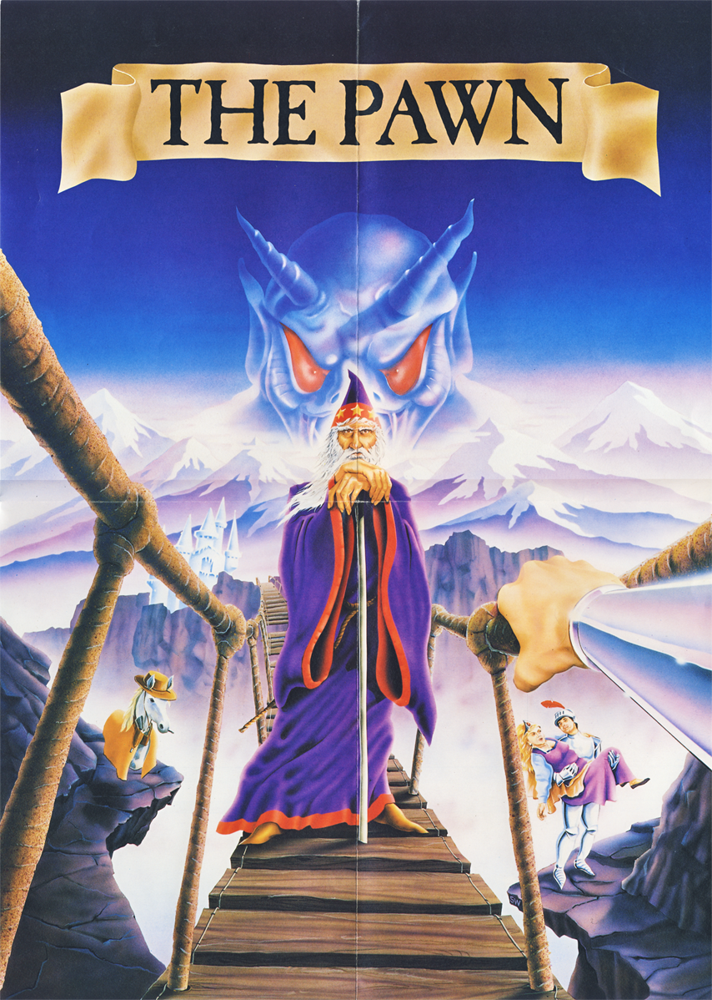

# The Pawn Atari ST

## Disk Format

The disk is a standard single-sided 80 track MFM disk with no timing tricks or anything special. The copy protection simply lies in the fact that the track and sector number in the sector header are non-standard values, which can not be written via the Atari ST, like the value $F7 as a track or sector number. The software never writes to the disk.

Track 0: Sector 1..9, normal TOS format. The directory contains THE_PAWN.TOS (the loader) and a README.TXT. It needs to be started manually, there is not AUTO folder.
Track 1..79: 5 Sectors, each 1kb large which contain a custom filesystem.

The whole flux stream to recreate the floppy is available in `The Pawn Kryoflux Stream.zip` or directly loadable in an Atari emulator as `The Pawn 2.1.stx`.

A version loadable from harddisk with all manuals as PDFs is available in the `The Pawn` folder.

## Disk Access

The disc is considered a stream of bytes and addressed via an `offset`. 0 is the beginning. 401316 is the first unused byte on "The Pawn 2.1" for the Atari ST.

The `offset` is divided by 5120 ($1400) to get the `track` number. Each `sector` (0..4) is 1024 ($400) bytes large. Within that `sector` it is a simple `byte offset` of the reminder.

The track (physical track and logic track number in the sector header) and the sector numbers are calculated based on a simple scheme:

- physical track position for the read header: 79 - `track`
- logical track number within the sector header: $FF - `track`
- logical sector number within the sector header: `sector` + ($FF - `track`) - 4

Example:
For offset 0, we need to read track #0, sector #0, we therefore need to seek to the physical track 79 and read the logical sector with the header containing track #$FF and  sector #$fc.

## Loading files from the disk

The disk starts with a directory structure at offset #0 with 256 bytes in length (allowing up to 63 files). This directory structure is loaded first. Files are an `index` number, which is multiplied by 4 to point into that structure. The length of the file is the delta to the next offset in the directory. For "The Pawn 2.1" highest index is #34, resulting in 34 possible files.

## The files on the disk

The Python script [pawn_dir_lister.py](pawn_dir_lister.py) prints out the content of the directory. All these files are extracted from the disk and are available in the `Generated Floppy Files` folder.

	DIR : o:00000000 len:00000100 The directory of the disk
	# 0 : o:00000100 len:00000104 The loader and decompression code for the main game
	# 1 : o:00000204 len:0001acaa The main game code, compressed
	# 2 : o:0001aeae len:0000219a image #0 - scene image
	# 3 : o:0001d048 len:0000281e image #1 - scene image
	# 4 : o:0001f866 len:00001efa image #2 - scene image
	# 5 : o:00021760 len:00003880 image #3 - scene image
	# 6 : o:00024fe0 len:00002a52 image #4 - scene image
	# 7 : o:00027a32 len:000034ea image #5 - scene image
	# 8 : o:0002af1c len:00001a34 image #6 - scene image
	# 9 : o:0002c950 len:000012b8 image #7 - scene image
	#10 : o:0002dc08 len:00001f30 image #8 - scene image
	#11 : o:0002fb38 len:00001938 image #9 - scene image
	#12 : o:00031470 len:00002152 image #10 - scene image
	#13 : o:000335c2 len:00002fd2 image #11 - scene image
	#14 : o:00036594 len:000020fc image #12 - scene image
	#15 : o:00038690 len:00002eaa image #13 - scene image
	#16 : o:0003b53a len:00002c94 image #14 - scene image
	#17 : o:0003e1ce len:000017ba image #15 - scene image
	#18 : o:0003f988 len:000031ba image #16 - scene image
	#19 : o:00042b42 len:0000179e image #17 - scene image
	#20 : o:000442e0 len:00003122 image #18 - scene image
	#21 : o:00047402 len:000025b8 image #19 - scene image
	#22 : o:000499ba len:00000cb4 image #20 - scene image
	#23 : o:0004a66e len:000025f0 image #21 - scene image
	#24 : o:0004cc5e len:00003b66 image #22 - scene image
	#25 : o:000507c4 len:0000185a image #23 - scene image
	#26 : o:0005201e len:000019ee image #24 - scene image
	#27 : o:00053a0c len:00001954 image #25 - scene image
	#28 : o:00055360 len:00001bd6 image #26 - scene image
	#29 : o:00056f36 len:000036fc image #27 - scene image
	#30 : o:0005a632 len:00001786 image #28 - scene image
	#31 : o:0005bdb8 len:0000221c image #29 - scene image
	#32 : o:0005dfd4 len:00003abc image #30 - title screen
	#33 : o:00061a90 len:00000514 readme text - unused by the game, never loaded

## The application loading process

`THE_PAWN.TOS` reads the directory and then loads file #0 and executes it with a function pointer in register `A0`, which allows loading files with the `index` in `D0`. While being a standard TOS application, it is fully PC-relative and does not need Pexec() to relocate and being executed.

`THE_PAWN.TOS` prints "The Pawn. © Magnetic Scrolls 1985,1986 Loading...", then it loads file #1, which is the main application. It prints "Pondering..." and decompresses file #1 with a custom compression scheme and starts it the same way this loader was launched.

The Python script [pawn_decompress_app.py](pawn_decompress_app.py) implements the decompression of the application externally.

The main application has its own implementation of the custom floppy access, very similar to the loader code in `THE_PAWN.TOS`. Within the app this code is encrypted and only decrypted during the loading process of files. The same encryption code is used for save game files and some code of that is also checked by using it as a pseudo-random generator. The checksum code over that block seems to be not used. The decryption code is loaded from the Python script [pawn_decrypt_data.py](pawn_decrypt_data.py). The decryption is XOR-based, so it is fully symmetrical.

To make analyzing the application easier, the [pawn_decompress_app.py](pawn_decompress_app.py) also decrypts the loading code and patches out the decryption code for loading. It stays in place for save game files, so compatibility is still existant. Furthermore I've patched out the sector read access to use GEMDOS for loading the files, which allows running The Pawn directly from harddisk.

After launching the main application, the sector read code reads the directory and then shows the title screen (on a color monitor) and the game starts.

## The image file formats

The images are 16 color Atari low-res images, but compressed similarity to the main application. I've written a small Python script [pawn_image_reader.py](pawn_image_reader.py), which reads the images and writes them into `AtariImages` as DEGAS low-res files.

The 30 scenes are 280 or 288 pixels wide and between 136 and 161 pixels high with 16 colors.

The title screen is 274x200 pixels large, but with 16 colors _per_ pixel line. The color palettes for each line are stored at the very end within the game application, not in the image itself. For that reason it is written as a Spectrum 512 (uncompressed) image. Not sure if that works, because I can not read/convert the SPU file. If you want to try it yourself: it is decompressed into a 320x200 image and the 200 Atari 16-color palettes are extracted out of the main game.

## Save games

The Pawn can save games on floppy or harddisk. The files are 9809 bytes large and encrypted including checksums. The encryption is the same as for the copy protection, just with a different key. The Python script [pawn_decompress_save.py](pawn_decompress_save.py) decodes the save game and also validates the checksum. I have not looked into what is stored, it seems just a memory dump of all relevant data.

## Cypheric help system

The hints at the end of the manual are encrypted and can only be decrypted within The Pawn, sometimes they even require a minimum number of points to show. These also seem to be some typos in the hints in the manual…

I've written a general decode for all hints, available again as a Python script [pawn_hint_decoder.py](pawn_hint_decoder.py) or you can just read all hints directly at [pawn_hints.md](pawn_hints.md).
